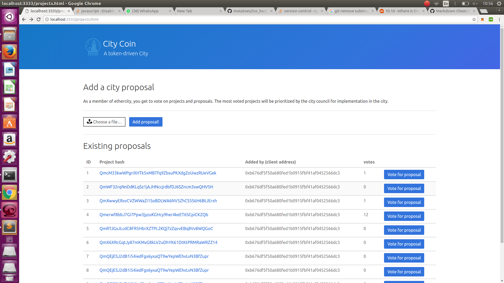

# ico_hackathon
**Grand prize winner**. City Coin project entry. A token for building cities. Entry for team `City Coin` in the applied blockchain fintech week hackathon 7th of July 2017.



# How to run

- Install metamask on chrome
- Run the IPFS deamon service

```
$ cd ipfs/
$ ./run
``` 

- In another console, run the server to host the web3 dapp page. Note that CORS should be enabled for the dapp to work. You can enable this by adding this plugin to chrome and then adding a link to `http://localhost:5000/*`
```
$ cd projects/
$ ./run
```

Then visit `http://localhost:3000` to preview the dapp.
